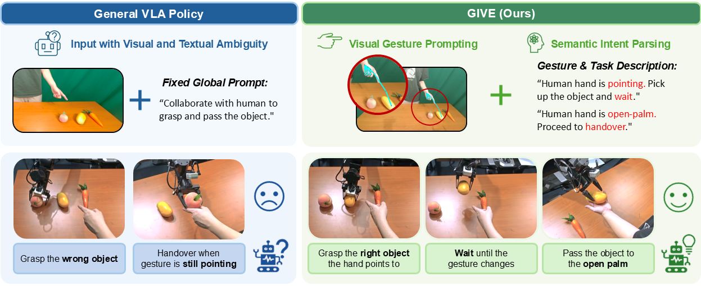
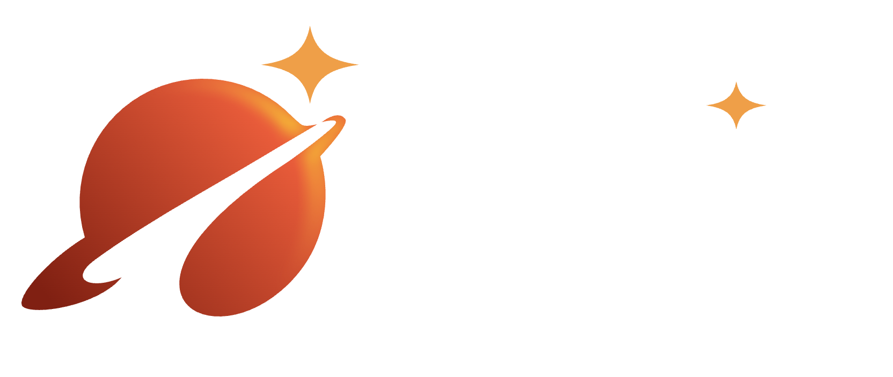

<h1 align="center">Feedback World Model Enables Precise Guidance of Diffusion Policy</h1>

  
  
  
  

  <a href="https://openreview.net/profile?id=~Pengfei_Liu21" target="_blank" rel="noopener"><strong>Pengfei Liu</strong></a>1,* &nbsp;&nbsp;
  <a href="https://reagan1311.github.io/" target="_blank" rel="noopener"><strong>Gen Li</strong></a>1,* &nbsp;&nbsp;
  <strong>Junqiao Fan</strong>1 &nbsp;&nbsp;
  <a href="https://ma-boyu.github.io/" target="_blank" rel="noopener"><strong>Boyu Ma</strong></a>1 &nbsp;&nbsp;
  <a href="https://jiajindou.github.io/" target="_blank" rel="noopener"><strong>Jindou Jia</strong></a>1 &nbsp;&nbsp;
  <strong>Yang Xiao</strong>1 &nbsp;&nbsp;
  <a href="https://marsyang.site/"><strong>Jianfei Yang</strong></a>1,†

  1MARS Lab, Nanyang Technological University, Singapore

  *Equal contribution &nbsp;&nbsp;&middot;&nbsp;&nbsp; †Corresponding author

  

<table align="center" width="90%">
  <tr>
    <td valign="top">
      <b>Abstract.</b> Human communication is inherently multimodal, where language is often accompanied by non-verbal cues such as gestures to convey intentions. However, current Vision-Language-Action (VLA) models treat robotic manipulation as a pure text-driven task, overlooking the important role of gestures in Human-Robot Interaction (HRI). This often leads to inaccurate intent grounding and unreliable manipulation when language instructions are ambiguous or underspecified.To address this challenge, we propose GIVE (<b>G</b>esture <b>I</b>ntent via <b>V</b>isual-Semantic <b>E</b>nhancement) , an effective approach that enhances pre-trained VLA models with human gesture understanding without architectural modifications. Specifically, GIVE incorporates gesture information through two complementary pathways: a visual pathway that overlays hand skeletons and fingertip rays onto robot observations for explicit object grounding, and a semantic pathway that generates high-level descriptions of human gestures and task instructions for robust intent grounding. By jointly leveraging visual and semantic guidance, GIVE enables VLA policies to better associate gestures with manipulation behaviors and adapt to dynamic interaction intents. In real-world HRI experiments, GIVE substantially outperforms the baseline, improving target object recognition accuracy by 40% and overall task success rate by 80%, while demonstrating strong robustness and generalization to unseen spatial layouts and diverse participants.
        
      
      <b>Correspondence:</b> Jianfei Yang &lt;<a href="mailto:jianfei.yang@ntu.edu.sg">jianfei.yang@ntu.edu.sg</a>&gt;
    </td>
  </tr>
</table>
